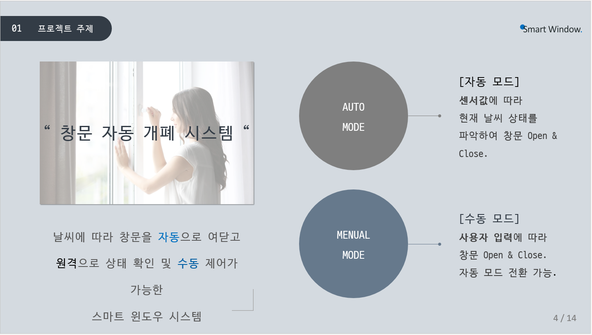
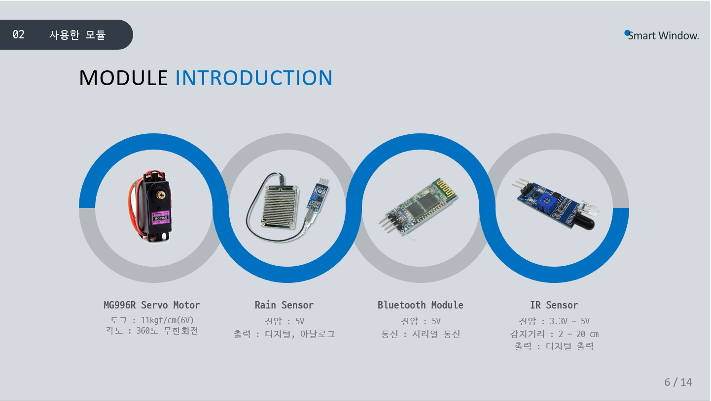
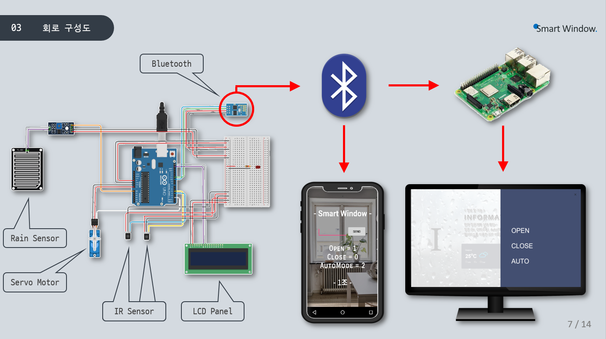
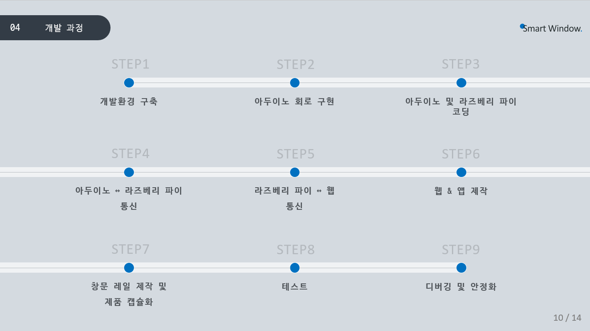
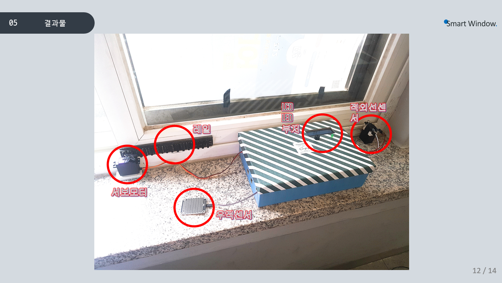

<h1>스마트 윈도우 프로젝트 - 자동 창문 개폐 시스템</h1>

스마트 윈도우 프로젝트 - 자동 창문 개폐 시스템을 구현한 프로젝트입니다.

<h1>목차</h1>
<ul>
  <li>목적</li>
  <li>결과</li>
</ul>

<h1>목적</h1>

스마트 윈도우 프로젝트 - 자동 창문 개폐 시스템

미세먼지와 강수 등 여러가지 변수를 차단하는 시스템을 만들어보았다.

<h1>결과</h1>

